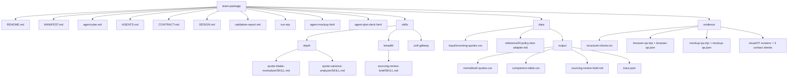

# Sourcing Operations Lab agent plan

## 1. Team and purpose

Sourcing Operations Lab은 주간 및 수시로 들어오는 공급업체 견적을 누락 없이 정규화하고 정책 대비 편차를 설명 가능한 근거와 함께 정리해, 구매담당자의 예외 확인과 공급업체 선택을 돕는다. Lv4는 `Strategic sourcing`, Lv5는 `Supplier quote evaluation`이다.

## 2. One-sentence role, 하는 일, and 하지 않는 일

한 문장 역할: 확인된 가상 견적과 조달 정책을 읽어 비교 검토 브리프까지 연결하되, 모든 구매 판단과 외부 실행은 사람에게 남긴다.

- 하는 일: 모든 견적 행 읽기, 지원 통화의 KRW 정규화, 파싱 상태 보존, 품목 코드 기준 정책 매칭, 가격·납기 편차 판정, 행별 근거 작성, 전체 견적 브리프 작성.
- 하지 않는 일: 누락 가격 추론, 실패 행 삭제, 정책 수정, 공급업체 승인·선택, 공급업체 연락, 구매주문 전송, ERP 쓰기.

## 3. Data specification

| 데이터 | 열 | 정본 위치 | 읽기 | 쓰기 |
|---|---|---|---|---|
| `incoming-quotes.csv` | `quote_id, supplier_code, item_code, unit_price, lead_days, currency` | 승인된 입력 번들 | `quote-intake-normalizer` | 패키지 내 writer 없음 |
| `sourcing-policy.csv` | `(미확인)` | 승인된 입력 번들 | `quote-variance-analyzer` | 패키지 내 writer 없음 |
| `normalized-quotes.csv` | `quote_id, supplier_code, item_code, unit_price_krw, lead_days, parse_status` | `data/output/normalized-quotes.csv` | `quote-variance-analyzer` | `quote-intake-normalizer` 단독 |
| `comparison-table.csv` | `quote_id, price_variance_pct, lead_variance_days, policy_status, evidence` | `data/output/comparison-table.csv` | `sourcing-review-brief` | `quote-variance-analyzer` 단독 |
| `sourcing-review-brief.md` | Markdown 산출물; 표 열 아님 | `data/output/sourcing-review-brief.md` | 구매담당자 | 표 writeback 없음; `sourcing-review-brief`가 렌더링 |

`sourcing-policy.csv`의 열 스키마는 승인 입력에 없으므로 패키지가 발명하지 않는다. 운영 연결 전 구매담당자가 열과 기준값 위치를 확인해야 한다.

## 4. Representative scenario

- Trigger: 주간 또는 수시 가상 견적 번들이 도착한다.
- Input: `incoming-quotes.csv`와 승인된 `sourcing-policy.csv`.
- Processing: `node run.mjs`가 모든 행을 보존해 정규화하고, 확인된 합성 L4 fixture로 `12% 초과` 가격 편차, `7일 초과` 납기 편차, 파싱 실패를 검토 대상으로 표시한다. 검토 대상이 있으면 구매담당자 검토 hold에서 멈춘다.
- Output: 모든 견적과 근거, 해결되지 않은 질문, 구매담당자의 다음 행동을 담은 `sourcing-review-brief.md`와 같은 실행 사실을 기록한 `trace.json`. `agent-mockup.html`과 `agent-plan-deck.html`은 이 사실을 시각화하며 공급업체 선택과 구매주문은 산출하지 않는다.

## 5. Writeback rules

`quote-intake-normalizer`만 `normalized-quotes.csv`의 여섯 열에 한 번씩 쓰며, 모든 입력 `quote_id`를 정확히 한 번 보존한다. `quote-variance-analyzer`만 `comparison-table.csv`의 다섯 열에 쓰며, 모든 정규화 견적에 `policy_status`와 필요한 근거를 남긴다. `sourcing-review-brief`는 표를 쓰지 않고 Markdown 브리프를 렌더링한다. 입력·정책 파일은 읽기 전용이며 ERP writeback은 승인되지 않았다.

## 6. Integration map

현재는 독립. ERP write connector를 포함한 외부 통합은 승인되지 않았다.

## 7. Validation and human-in-the-loop points with reasons

- 중간 정지 `buyer-variance-review-hold`: 가격 편차가 `12% 초과`, 납기 편차가 `7일 초과`, 파싱 실패, 정책 매칭 누락 또는 모호성이 있으면 구매담당자가 정책 예외와 근거를 확인할 때까지 중단한다. 이유는 정책 판단이 사람 책임이기 때문이다.
- 최종 정지 `buyer-confirmation-hold`: 브리프가 모든 견적을 다룬 뒤 구매담당자가 예외와 공급업체 선택을 확인할 때까지 중단한다. 이유는 공급업체 선택과 구매 승인이 사람 책임이기 때문이다.
- 금지된 외부 실행: 공급업체 연락, 구매주문 전송, ERP 쓰기는 어떤 단계에서도 실행하지 않는다.
- 패키지 판정: 독립 AI 작업 3개가 각자 입력·출력·소유자·인수 조건을 가지며 하나의 도달 가능한 체인을 이룬다. L0–L4 통과 시 `team agent`; 실제 작업 수가 2개 이하가 되면 동일 계약과 사람 정지점을 유지한 채 `team skillpack`으로 되돌린다.

## 8. Mermaid folder tree reflecting the actual package

