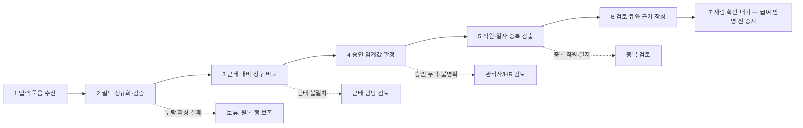

# 초과근무 승인 감사 워크플로 — 결과

## TL;DR

가상 제조업체(120명)의 한 주간 초과근무 9행을 감사한 결과, 정책상 바로 통과할 수 있는 행은 4개이고 사람 검토가 필요한 행은 5개다. 검토 큐에는 평일 2시간 초과 승인 누락 1행, 주말 승인 누락 1행, 동일 직원·일자 중복 2행, 근태보다 큰 청구 1행이 보존된다. 마지막 단계는 사람의 확인 대기에서 멈추며 급여 테이블 반영이나 외부 메시지는 수행하지 않는다.

## 1. 설계 모더레이터

### HR 사례와 운영 목표

- 사례: 120명 제조업체의 가상 초과근무 승인 감사
- Lv5 활동: 제출된 초과근무 행을 근태 기록, 승인 코드, 정책 임계값과 대조해 `감사 검토 큐`를 만드는 일
- 입력 묶음: `employee_id`, `work_date`, `weekday_or_weekend`, `attendance_minutes`, `claimed_minutes`, `approval_code`가 있는 합성 행 9개
- 주 산출물: 급여 반영 전 사람 검토용 `overtime_audit_review_queue`
- 적용 정책: 평일 초과근무가 120분 초과면 관리자 승인 필요, 주말 근무는 항상 관리자 승인 필요, 동일 직원·일자 행은 검토 대상

### 선택한 활동과 이유

선택 활동은 **초과근무 제출 감사 및 검토 큐 생성**이다. 비교 규칙과 중복 검출은 반복 가능하고, 근거 열을 함께 남길 수 있어 감사 가능한 To-Be 흐름으로 좁히기 좋다.

### 제외한 인접 활동

채용·평가·징계·직원 통지·근무시간 정정·급여 확정·급여 전송·회계 이체는 범위에서 제외한다. 이 워크플로는 초과근무 행의 검토 준비에서 멈춘다.

### AI 보조와 사람 경계

- AI 보조: 예외 유형과 근거를 요약하고, 중복·승인 누락·근태 불일치의 검토 순서를 제안한다.
- 결정 규칙: 정책 비교, 중복 키 생성, 수량 계산은 결정론적 규칙이 수행하며 AI가 숫자를 재해석하지 않는다.
- 사람 전용 결정: 승인 코드의 진위·예외 사유를 확인하고, 검토 큐를 급여 반영 대상으로 놓을지 결정한다.
- 외부 행동 경계: 사람 확인 전 어떤 급여 시스템 쓰기, 전송, 메시지, 이체도 하지 않는다.

### 반대 논리

자동화가 최선이 아닐 수 있다. 현장 교대·긴급정비 같은 맥락은 여섯 개 필드만으로 설명되지 않고, 승인 코드가 유효해도 실제 승인권자와 일치하지 않을 수 있다. 따라서 자동화는 증거가 있는 정렬·플래그까지만 맡기고, 해석과 급여 반영은 사람이 맡는 편이 되돌리기 쉽다.

## 2. To-Be 와이어프레임

| 노드 | 실행 환경 | 자동 규칙과 증거 | 소유자/산출 |
|---|---|---|---|
| 1 입력 묶음 수신 | `workspace` | 지정 6개 필드가 있는지, 원본 행 수 | HR 운영 / 원본 스냅샷 |
| 2 필드 정규화·검증 | `workspace` | 날짜 형식, 분 단위 정수, 빈 값; `source_row_ref` | 데이터 운영 / 보존된 정규화 행 |
| 3 근태 대비 청구 비교 | `workspace` | `claimed_minutes <= attendance_minutes`; 두 분 값을 근거로 기록 | HR 운영 / `attendance_mismatch` 플래그 |
| 4 승인 임계값 판정 | `workspace` | 평일 `claimed_minutes > 120` 또는 주말이면 `approval_code` 비어 있지 않아야 함 | HR 운영 / `approval_missing` 플래그 |
| 5 직원·일자 중복 검출 | `workspace` | 키 `employee_id + work_date`의 출현 횟수 > 1 | HR 운영 / `duplicate_employee_date` 플래그 |
| 6 검토 큐와 근거 작성 | `workspace` | 각 플래그에 evidence, owner, next_action을 붙이고 모든 행 보존 | 테이블 작성자 / source-of-truth 큐 |
| 7 사람 확인 대기 | `human` | 사람이 승인 코드·예외 맥락을 확인한 뒤에만 release 결정 | HR 관리자 / 보류 또는 반환 결정 |

예외의 공통 원칙은 **삭제하지 않고 보류**하는 것이다. 누락·현재만 있음·이전만 있음·매칭 불가·불명확·파싱 실패 상태도 원본 참조와 함께 큐에 남기고, 소유자와 다음 행동을 배정한다. 이번 9행에는 현재/이전 전용이나 파싱 실패가 없지만, 스키마는 해당 상태를 수용한다.

## 3. Activity Coach 패키지

### 권장 형태: team skillpack

독립적인 AI 작업이 두 개이므로 `team skillpack`이 적합하다. 세 개 이상의 독립 작업이 각각 별도 입력·출력·소유자·인수 테스트를 가질 때만 `team agent`로 승격한다. 작업 수가 다시 두 개 이하로 줄면 skillpack으로 되돌린다.

1. **`overtime-audit-triage` skill** — 정규화된 행과 결정론적 플래그를 입력으로 받아 예외 유형별 근거 요약, owner, next action을 출력한다. 인수 테스트는 모든 입력 행이 하나의 보존된 결과 행과 연결되고, 근거가 입력 필드 또는 규칙으로 추적되는 것이다.
2. **`hold-decision-brief` skill** — 검토 큐를 입력으로 받아 사람에게 보여줄 보류 요약을 만들되, 승인·급여 반영 결정을 하지 않는다. 인수 테스트는 `payroll_release_allowed`를 사람 확인 전 `false`로 유지하고, 미확인 예외를 누락하지 않는 것이다.

정규화와 숫자 계산은 별도 결정론적 단계이고, 표 쓰기는 별도 `table-writer` 책임이다. `table-writer`는 승인된 스키마에 행을 쓰지만 외부 급여 시스템에는 쓰지 않는다. 최종 보류는 `human-hold` 책임으로 사람 확인 노드에 고정한다.

### Source of truth

- 테이블: `overtime_audit_review_queue`
- 작성자: `table-writer` (내부 workspace에만 기록)
- 필수 열: `audit_id`, `employee_id`, `work_date`, `weekday_or_weekend`, `attendance_minutes`, `claimed_minutes`, `approval_code`, `rule_result`, `exception_type`, `evidence_ref`, `owner`, `next_action`, `status`, `payroll_release_allowed`
- 초기 상태: `status = review_needed | policy_clear`, `payroll_release_allowed = false`

## 4. 가상 테스트 행과 실제 집계

아래 9행은 모두 합성 데이터다. `EMP-X07` 두 행은 의도적으로 동일 직원·일자 키를 공유한다.

| # | employee_id | work_date | weekday_or_weekend | attendance_minutes | claimed_minutes | approval_code | 판정 근거 |
|---:|---|---|---|---:|---:|---|---|
| 1 | EMP-X01 | 2026-08-17 | weekday | 600 | 90 | — | 정책 통과 |
| 2 | EMP-X02 | 2026-08-18 | weekday | 600 | 150 | MGR-X02 | 평일 120분 초과, 승인 있음 |
| 3 | EMP-X03 | 2026-08-19 | weekday | 600 | 180 | — | 평일 초과 승인 누락 |
| 4 | EMP-X04 | 2026-08-22 | weekend | 480 | 60 | MGR-X04 | 주말 승인 있음 |
| 5 | EMP-X05 | 2026-08-23 | weekend | 420 | 45 | — | 주말 승인 누락 |
| 6 | EMP-X06 | 2026-08-20 | weekday | 480 | 120 | — | 정확히 120분, 승인 불필요 |
| 7 | EMP-X07 | 2026-08-21 | weekday | 480 | 120 | MGR-X07 | 동일 직원·일자 중복 검토 |
| 8 | EMP-X07 | 2026-08-21 | weekday | 480 | 90 | MGR-X07 | 동일 직원·일자 중복 검토 |
| 9 | EMP-X08 | 2026-08-24 | weekday | 480 | 600 | MGR-X08 | 근태보다 큰 청구, 불일치 검토 |

행에서 직접 도출한 결과:

- 전체 제출 행: **9**
- 정책 통과 행: **4** (X01, X02, X04, X06)
- 사람 검토 행: **5** (X03, X05, X07 두 행, X08)
- 평일 2시간 초과 승인 누락: **1** (X03)
- 주말 승인 누락: **1** (X05)
- 중복 직원·일자 행: **2** (X07 두 행)
- 근태보다 큰 청구: **1** (X08)

중복 플래그는 정책 예외로 별도 집계되어 검토 행 5개에 포함된다. 예외마다 소유자와 다음 행동은 다음과 같다.

| 예외 | 행 | 소유자 | 다음 행동 |
|---|---|---|---|
| 평일 초과 승인 누락 | EMP-X03 | 해당 라인 관리자 | 승인 증거를 확인하고 승인/반환 결정 |
| 주말 승인 누락 | EMP-X05 | 해당 라인 관리자 | 주말 근무 승인 여부 확인 |
| 중복 직원·일자 | EMP-X07 2행 | HR 운영 | 원본 제출을 대조해 한 행을 취소할지 사람 결정 |
| 근태 불일치 | EMP-X08 | 근태 담당 | 출퇴근 기록 원본과 청구 시간을 대조 |

## 5. 검증과 사람 인수

- 9개 가상 행은 수신부터 검토 큐까지 모두 보존된다. 제외·삭제·조용한 실패는 없다.
- 결과 카드의 9, 4, 5 및 예외 집계 1·1·2·1은 위 생성 행에서 직접 계산했다.
- 모든 예외는 owner와 next action을 갖는다.
- 최종 payroll 결정은 `human` 노드에 남고, 사람 확인 전 `payroll_release_allowed = false`다.
- 외부 메시지, 이체, 급여 시스템 쓰기, 급여 반영은 수행하지 않는다.
- `presentation.html`에는 슬라이드가 정확히 9개이며, 외부 자산·네트워크 요청이 없다.
- placeholder, TODO, 임의 점수, 근거 없는 성과·컴플라이언스 주장은 없다.
- 한국어 문장과 파일 식별자는 문자 단위로 의도적으로 쪼개지지 않도록 `word-break: keep-all`과 `white-space: nowrap`을 사용했다.
- 27개 브라우저 체크 결과: **27/27 통과**. Chrome Headless로 각 화면을 375×667, 768×720, 1280×720에서 열고, 세 뷰포트의 모든 화면에서 `scrollHeight <= clientHeight + 1`, `scrollWidth <= clientWidth + 1`을 직접 측정했다. 세 뷰포트 모두 측정값이 각각 `667/667, 375/375`, `720/720, 768/768`, `720/720, 1280/1280`으로 일치했다.

## 6. 운영 판정과 변경 제안

운영 판정은 **조건부 사용 가능: 검토 큐 생성까지만**이다. 사람 확인이 없는 자동 급여 반영으로 확장하지 않는다.

실제 조직 사용 전에는 (1) 승인 코드의 권한자·유효기간 조회를 공식 시스템과 연결하고, (2) 교대·휴일 캘린더의 source of truth를 정하고, (3) 근태 원본의 수정 이력과 접근 로그를 붙이고, (4) 보존기간·권한·이의제기 절차를 승인받아야 한다. HR 운영 책임자, 근태 시스템 소유자, 급여 책임자, 개인정보·노무 검토자가 각각 승인한 뒤에만 실제 데이터로 파일럿한다.
