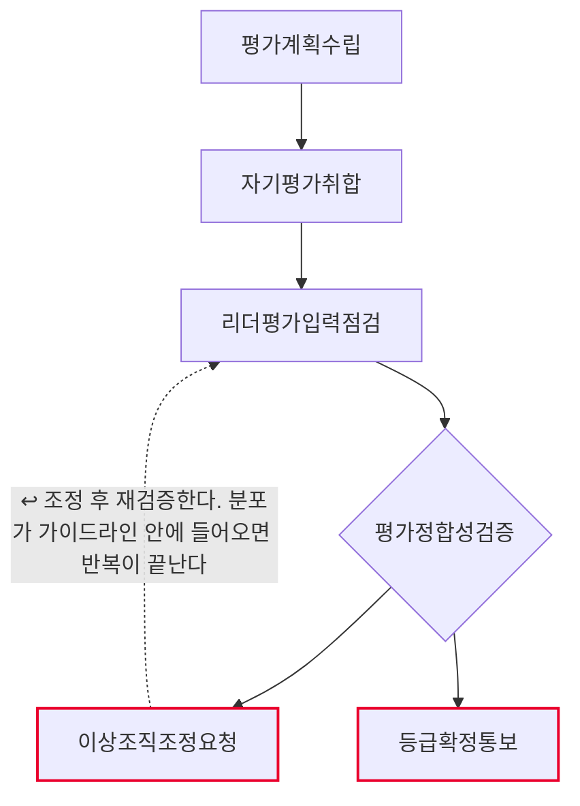
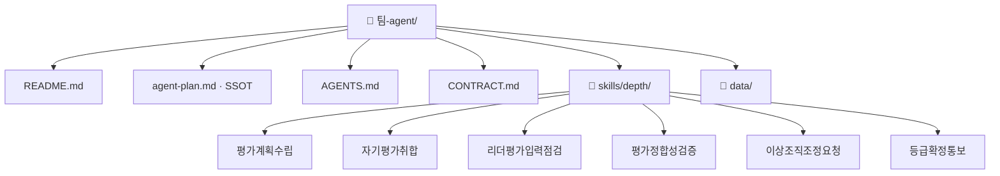

# 연간 성과평가 운영 팀 기획서 (워크플로우 변환 초안)

## 1. 팀과 목적
- Lv4: 평가·보상
- Lv5: 연간 성과평가 운영

## 2. 역할 정의
- 한 문장: (미정 — 인터뷰 Q2)
- 하는 일: 평가계획수립 · 자기평가취합 · 리더평가입력점검 · 평가정합성검증
- 하지 않는 일: 이상조직조정요청 · 등급확정통보

## 2-1. 태스크 구성
| # | Lv6 | Human 여부 | Skill화 | 다음 태스크 |
|---|---|---|---|---|
| 1 | 평가계획수립 | 자동 | 높음 | 자기평가취합 |
| 2 | 자기평가취합 | 자동 | 높음 | 리더평가입력점검 |
| 3 | 리더평가입력점검 | 증강 | 중간 | 평가정합성검증 |
| 4 | 평가정합성검증 | 증강 | 중간 | 이상조직조정요청 또는 등급확정통보 |
| 5 | 이상조직조정요청 | 사람고유 | 낮음 | 리더평가입력점검 ↩루프백 |
| 6 | 등급확정통보 | 사람고유 | 낮음 | (끝) |

AI 태스크(자동+증강) 4개 · 사람고유 2개 · 갈림길 있음(경로 2개) · 루프백 있음

## 3. 데이터 명세
| 표 이름 | 칸 이름 | 원본 위치(SSOT) | 읽기/쓰기 |
|---|---|---|---|
| (미정) | (미정) | (미정) | (미정) |
> 설계도에는 표·칸 명세가 없다. 세션 6 인터뷰 Q3에서 확정한다.

## 4. 대표 시나리오
- 입력: 연간성과평가운영입력
- 경로: 평가계획수립 → 자기평가취합 → 리더평가입력점검 → 평가정합성검증 → 이상조직조정요청 → 출력: 이상조직조정요청결과
- 경로: 평가계획수립 → 자기평가취합 → 리더평가입력점검 → 평가정합성검증 → 등급확정통보 → 출력: 등급확정통보결과

## 5. 결과물 반영 규칙
- (미정 — 인터뷰 Q5)

## 6. 연동 맵
- (미정 — 인터뷰 Q6)

## 7. 검증·휴먼인더루프 지점
- 이상조직조정요청 — 사람고유. 확인 요청 후 멈춘다.
- 등급확정통보 — 사람고유. 확인 요청 후 멈춘다.

## 8. 흐름도

- 마름모 = 갈림길 · 빨간 테두리 = 사람이 직접 판단하는 지점 · 점선 = 루프백(되돌아가기)

## 9. 폴더 트리

