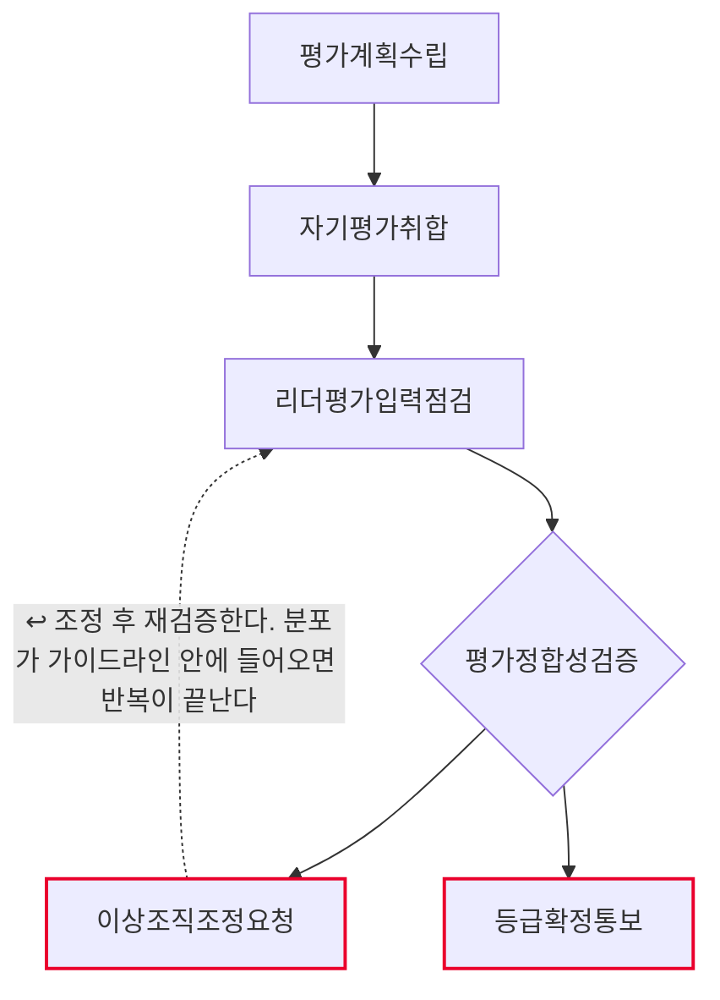
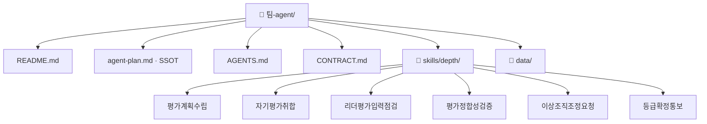

# 연간 성과평가 운영 팀 기획서 (워크플로우 변환 초안)

## 1. 팀과 목적
- Lv4: 평가·보상
- Lv5: 연간 성과평가 운영

## 2. 역할 정의
- 한 문장: 연간 성과평가의 자기평가·리더평가를 모아 점검하고, 조직별 등급 분포가
  가이드라인 안에 들어오는지 검증한다. 등급 확정과 통보는 하지 않는다.
- 하는 일: 평가계획수립 · 자기평가취합 · 리더평가입력점검 · 평가정합성검증
- 하지 않는 일: 이상조직조정요청 · 등급확정통보

## 2-1. 태스크 구성
| # | Lv6 | Human 여부 | Skill화 | 다음 태스크 |
|---|---|---|---|---|
| 1 | 평가계획수립 | 자동 | 높음 | 자기평가취합 |
| 2 | 자기평가취합 | 자동 | 높음 | 리더평가입력점검 |
| 3 | 리더평가입력점검 | 증강 | 중간 | 평가정합성검증 |
| 4 | 평가정합성검증 | 증강 | 중간 | 이상조직조정요청 또는 등급확정통보 |
| 5 | 이상조직조정요청 | 사람고유 | 낮음 | 리더평가입력점검 ↩루프백 |
| 6 | 등급확정통보 | 사람고유 | 낮음 | (끝) |

AI 태스크(자동+증강) 4개 · 사람고유 2개 · 갈림길 있음(경로 2개) · 루프백 있음

## 3. 데이터 명세

| 표 이름 | 칸 이름 | 원본 위치(SSOT) | 읽기/쓰기 |
|---|---|---|---|
| 평가데이터.md › 평가일정 | 단계·마감일·상태 | 인사운영팀 평가 일정 | 평가계획수립이 읽기 |
| 평가데이터.md › 평가대상자 | 사번·성명·조직·직급·입사일 | HR ERP 인사마스터 | 평가계획수립·자기평가취합이 읽기 |
| 평가데이터.md › 자기평가제출 | 사번·제출여부·제출일·비고 | 평가시스템 제출 로그 | 자기평가취합이 읽기 |
| 평가데이터.md › 리더평가입력 | 사번·평가리더·등급·입력일·근거기재 | 평가시스템 리더 입력 | 리더평가입력점검이 읽기 |
| 평가데이터.md › 등급분포가이드라인 | 등급·권장비율·허용상한 | 전사 평가 운영기준 | 평가정합성검증이 읽기 |
| 평가데이터.md › 근거요구등급 | 등급·근거필수 | 전사 평가 운영기준 | 리더평가입력점검이 읽기 |
| 자기평가취합결과.md | 사번·성명·조직·제출여부·제출일·상태 | 이 에이전트가 생성 | 자기평가취합이 쓰기 |
| 리더평가점검결과.md | 사번·성명·조직·평가리더·등급·근거기재·점검결과 | 이 에이전트가 생성 | 리더평가입력점검이 쓰기 |
| 분포검증결과.md | 조직·인원·등급·인원수·비율·허용상한·판정 | 이 에이전트가 생성 | 평가정합성검증이 쓰기 |

입력은 **`data/평가데이터.md` 한 파일**이고, 그 안에 표 6개가 `## 제목`으로 나뉘어 있다.
표마다 왜 그 값인지가 문장으로 붙어 있어 교육생이 값을 고쳐가며 흐름이 어디로 갈라지는지 볼 수 있다.
산출물도 전부 마크다운 표로 나온다 — 만든 것을 그대로 열어 볼 수 있다.

> 실습용 **가상 값**이다. 사번·성명·조직·등급 모두 실재하지 않는다.
> 실도입 전에 HR ERP·평가시스템의 실제 데이터로 교체한다.

## 4. 대표 시나리오
- 입력: 연간성과평가운영입력
- 경로: 평가계획수립 → 자기평가취합 → 리더평가입력점검 → 평가정합성검증 → 이상조직조정요청 → 출력: 이상조직조정요청결과
- 경로: 평가계획수립 → 자기평가취합 → 리더평가입력점검 → 평가정합성검증 → 등급확정통보 → 출력: 등급확정통보결과

## 5. 결과물 반영 규칙
- 산출물은 전부 `out/` 아래 마크다운 표다. 원본 데이터(`data/평가데이터.md`)는 고치지 않는다.
- 미제출·미입력은 채우지 않고 그대로 남긴다 — 없는 것과 낮은 것은 다르다.
- 등급은 어떤 단계에서도 스킬이 바꾸지 않는다. 조정은 사람이 확정한 것만 반영한다.

## 6. 연동 맵
- (미정 — 인터뷰 Q6)

## 7. 검증·휴먼인더루프 지점
- 이상조직조정요청 — 사람고유. 확인 요청 후 멈춘다.
- 등급확정통보 — 사람고유. 확인 요청 후 멈춘다.

## 8. 원본 대조 (디자인캠프 Lv3~Lv6 → 이 팩)

| 원본 계층 | 원본 항목 | 우리 계층 | 이 팩의 무엇이 되었나 |
|---|---|---|---|
| Lv3 업무 | 평가·보상 | **Lv4** | 문서에만 — 팩 범위 밖 |
| Lv4 프로세스 | P-B2-1 연간 성과평가 운영 | **Lv5** | **이 팩 = 에이전트 1개** |
| Lv5 Task | T-B2-1-1 평가계획수립 | **Lv6** | `skills/depth/평가계획수립/SKILL.md` |
| Lv5 Task | T-B2-1-2 자기평가취합 | **Lv6** | `skills/depth/자기평가취합/SKILL.md` |
| Lv5 Task | T-B2-1-3 리더평가입력점검 | **Lv6** | `skills/depth/리더평가입력점검/SKILL.md` |
| Lv5 Task | T-B2-1-4 평가정합성검증 | **Lv6** | `skills/depth/평가정합성검증/SKILL.md` |
| Lv5 Task | A-B2-1-4-3 이상조직조정요청 | **Lv6** | `skills/depth/이상조직조정요청/SKILL.md` |
| Lv5 Task | T-B2-1-5 등급확정통보 | **Lv6** | `skills/depth/등급확정통보/SKILL.md` |
| Lv6 Activity | (원본 문서 참조) | 판단기준 | 각 SKILL.md 본문 |

원본 Lv5 Task 6개 → 스킬 6개 (전부 옮김)

## 9. 흐름도

- 마름모 = 갈림길 · 빨간 테두리 = 사람이 직접 판단하는 지점 · 점선 = 루프백(되돌아가기)

## 10. 폴더 트리

