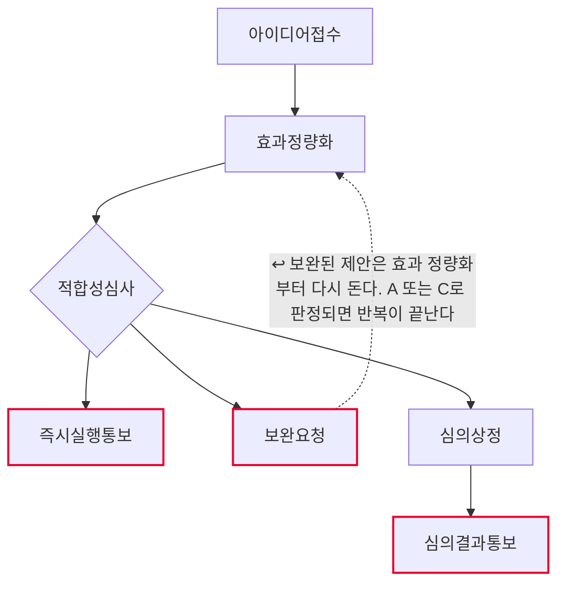
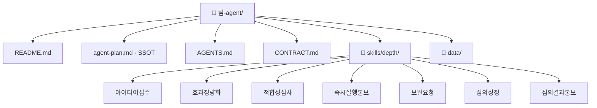

# 개선과제 발굴 및 심의 팀 기획서 (워크플로우 변환 초안)

## 1. 팀과 목적
- Lv4: 개선과제
- Lv5: 개선과제 발굴 및 심의

## 2. 역할 정의
- 한 문장: (미정 — 인터뷰 Q2)
- 하는 일: 아이디어접수 · 효과정량화 · 적합성심사 · 심의상정
- 하지 않는 일: 즉시실행통보 · 보완요청 · 심의결과통보

## 2-1. 태스크 구성
| # | Lv6 | Human 여부 | Skill화 | 다음 태스크 |
|---|---|---|---|---|
| 1 | 아이디어접수 | 자동 | 높음 | 효과정량화 |
| 2 | 효과정량화 | 자동 | 높음 | 적합성심사 |
| 3 | 적합성심사 | 증강 | 중간 | 즉시실행통보 또는 보완요청 또는 심의상정 |
| 4 | 즉시실행통보 | 사람고유 | 낮음 | (끝) |
| 5 | 보완요청 | 사람고유 | 낮음 | 효과정량화 ↩루프백 |
| 6 | 심의상정 | 증강 | 중간 | 심의결과통보 |
| 7 | 심의결과통보 | 사람고유 | 낮음 | (끝) |

AI 태스크(자동+증강) 4개 · 사람고유 3개 · 갈림길 있음(경로 3개) · 루프백 있음

## 3. 데이터 명세
| 표 이름 | 칸 이름 | 원본 위치(SSOT) | 읽기/쓰기 |
|---|---|---|---|
| (미정) | (미정) | (미정) | (미정) |
> 설계도에는 표·칸 명세가 없다. 세션 6 인터뷰 Q3에서 확정한다.

## 4. 대표 시나리오
- 입력: 개선과제발굴및심의입력
- 경로: 아이디어접수 → 효과정량화 → 적합성심사 → 즉시실행통보 → 출력: 즉시실행통보결과
- 경로: 아이디어접수 → 효과정량화 → 적합성심사 → 보완요청 → 출력: 보완요청결과
- 경로: 아이디어접수 → 효과정량화 → 적합성심사 → 심의상정 → 심의결과통보 → 출력: 심의결과통보결과

## 5. 결과물 반영 규칙
- (미정 — 인터뷰 Q5)

## 6. 연동 맵
- (미정 — 인터뷰 Q6)

## 7. 검증·휴먼인더루프 지점
- 즉시실행통보 — 사람고유. 확인 요청 후 멈춘다.
- 보완요청 — 사람고유. 확인 요청 후 멈춘다.
- 심의결과통보 — 사람고유. 확인 요청 후 멈춘다.

## 8. 원본 대조 (디자인캠프 Lv3~Lv6 → 이 팩)

| 원본 계층 | 원본 항목 | 우리 계층 | 이 팩의 무엇이 되었나 |
|---|---|---|---|
| Lv3 업무 | 개선과제 | **Lv4** | 문서에만 — 팩 범위 밖 |
| Lv4 프로세스 | P-D1-1 개선과제 발굴 및 심의 | **Lv5** | **이 팩 = 에이전트 1개** |
| Lv5 Task | T-D1-1-1 아이디어접수 | **Lv6** | `skills/depth/아이디어접수/SKILL.md` |
| Lv5 Task | T-D1-1-2 효과정량화 | **Lv6** | `skills/depth/효과정량화/SKILL.md` |
| Lv5 Task | T-D1-1-3 적합성심사 | **Lv6** | `skills/depth/적합성심사/SKILL.md` |
| Lv5 Task | A-D1-1-5-2 즉시실행통보 | **Lv6** | `skills/depth/즉시실행통보/SKILL.md` |
| Lv5 Task | T-D1-1-4 보완요청 | **Lv6** | `skills/depth/보완요청/SKILL.md` |
| Lv5 Task | T-D1-1-5 심의상정 | **Lv6** | `skills/depth/심의상정/SKILL.md` |
| Lv5 Task | A-D1-1-5-2b 심의결과통보 | **Lv6** | `skills/depth/심의결과통보/SKILL.md` |
| Lv6 Activity | (원본 문서 참조) | 판단기준 | 각 SKILL.md 본문 |

원본 Lv5 Task 7개 → 스킬 7개 (전부 옮김)

## 9. 흐름도

- 마름모 = 갈림길 · 빨간 테두리 = 사람이 직접 판단하는 지점 · 점선 = 루프백(되돌아가기)

## 10. 폴더 트리

