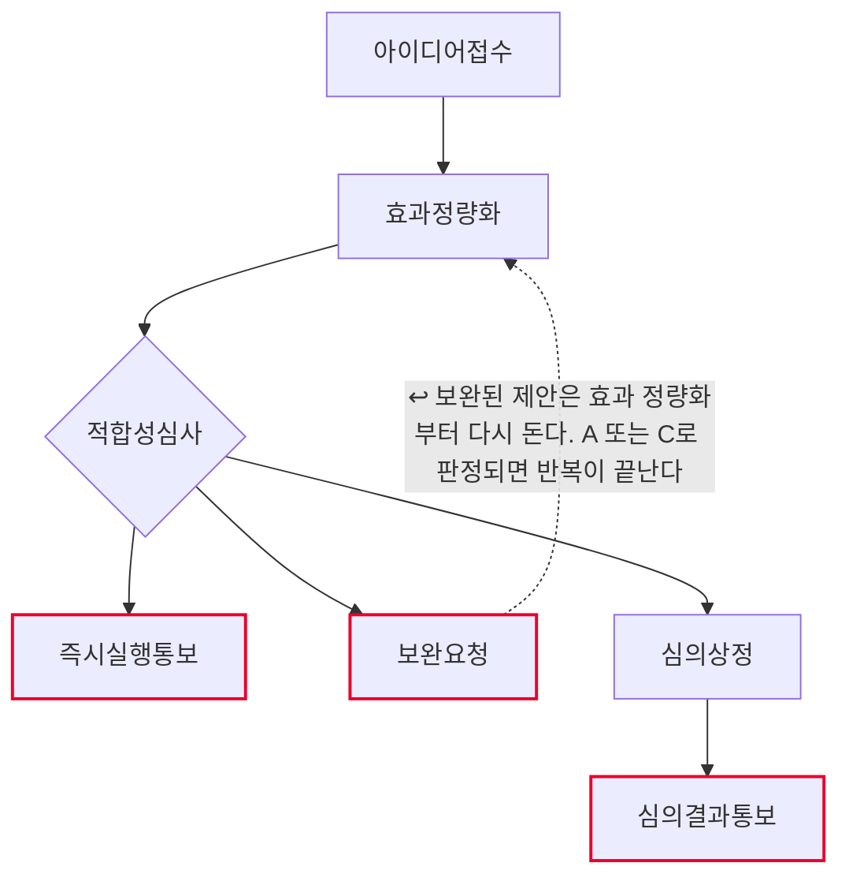
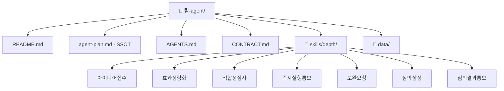

# 개선과제 발굴 및 심의 팀 기획서 (워크플로우 변환 초안)

## 1. 팀과 목적
- Lv4: 개선과제
- Lv5: 개선과제 발굴 및 심의

## 2. 역할 정의
- 한 문장: 개선 제안을 모아 효과를 정량화하고, 하나의 심사 기준으로 즉시실행·보완필요·
  심의필요로 나눈다. 통보와 심의는 하지 않는다.
- 하는 일: 아이디어접수 · 효과정량화 · 적합성심사 · 심의상정
- 하지 않는 일: 즉시실행통보 · 보완요청 · 심의결과통보

## 2-1. 태스크 구성
| # | Lv6 | Human 여부 | Skill화 | 다음 태스크 |
|---|---|---|---|---|
| 1 | 아이디어접수 | 자동 | 높음 | 효과정량화 |
| 2 | 효과정량화 | 자동 | 높음 | 적합성심사 |
| 3 | 적합성심사 | 증강 | 중간 | 즉시실행통보 또는 보완요청 또는 심의상정 |
| 4 | 즉시실행통보 | 사람고유 | 낮음 | (끝) |
| 5 | 보완요청 | 사람고유 | 낮음 | 효과정량화 ↩루프백 |
| 6 | 심의상정 | 증강 | 중간 | 심의결과통보 |
| 7 | 심의결과통보 | 사람고유 | 낮음 | (끝) |

AI 태스크(자동+증강) 4개 · 사람고유 3개 · 갈림길 있음(경로 3개) · 루프백 있음

## 3. 데이터 명세

| 표 이름 | 칸 이름 | 원본 위치(SSOT) | 읽기/쓰기 |
|---|---|---|---|
| 개선과제데이터.md › 개선제안 | 과제번호·제안자·소속·제안내용·접수일·상태 | 개선제안 시스템 | 아이디어접수가 읽기 |
| 개선과제데이터.md › 효과산정 | 과제번호·절감시간·대상인원·투자비·근거출처 | 제안자 제출 자료 | 효과정량화가 읽기 |
| 개선과제데이터.md › 산정기준 | 항목·값 | 운영혁신팀 산정 기준 (통일본) | 효과정량화·적합성심사가 읽기 |
| 개선과제데이터.md › 심사기준 | 등급·조건·다음 | 운영혁신팀 심사 규칙 | 적합성심사가 읽기 |
| 개선과제데이터.md › 심의일정 | 회차·개최일·상정마감일·상태 | 심의위원회 일정 | 심의상정이 읽기 |
| 접수목록.md | 과제번호·제안자·소속·제안내용·접수일·상태 | 이 에이전트가 생성 | 아이디어접수가 쓰기 |
| 효과산정결과.md | 과제번호·제안내용·절감시간·대상인원·연간절감액·투자비·근거·상태 | 이 에이전트가 생성 | 효과정량화가 쓰기 |
| 심사결과.md | 과제번호·제안내용·연간절감액·투자비·근거·등급·다음 | 이 에이전트가 생성 | 적합성심사가 쓰기 |
| 심의안건목록.md | 과제번호·제안내용·연간절감액·투자비·심의회차·상정상태 | 이 에이전트가 생성 | 심의상정이 쓰기 |

입력은 **`data/개선과제데이터.md` 한 파일**이고, 그 안에 표 5개가 `## 제목`으로 나뉘어 있다.
표마다 왜 그 값인지가 문장으로 붙어 있어 교육생이 값을 고쳐가며 흐름이 어디로 갈라지는지 볼 수 있다.
산출물도 전부 마크다운 표로 나온다 — 만든 것을 그대로 열어 볼 수 있다.

> 실습용 **가상 값**이다. 제안자·과제 내용·효과 금액 모두 실재하지 않는다.
> 실도입 전에 개선제안 시스템의 실제 데이터로 교체한다.

## 4. 대표 시나리오
- 입력: 개선과제발굴및심의입력
- 경로: 아이디어접수 → 효과정량화 → 적합성심사 → 즉시실행통보 → 출력: 즉시실행통보결과
- 경로: 아이디어접수 → 효과정량화 → 적합성심사 → 보완요청 → 출력: 보완요청결과
- 경로: 아이디어접수 → 효과정량화 → 적합성심사 → 심의상정 → 심의결과통보 → 출력: 심의결과통보결과

## 5. 결과물 반영 규칙
- 산출물은 전부 `out/` 아래 마크다운 표다. 원본 데이터(`data/개선과제데이터.md`)는 고치지 않는다.
- 반려 제안은 집계에서 빼되 표에서 지우지 않는다.
- 근거는 제안자가 보완한 것만 반영한다. 스킬이 근거를 만들지 않는다.
- 심의 결과는 위원회가 열려야 생긴다. 회의 전이면 결과 칸을 비워 두고 그 사실을 적는다.

## 6. 연동 맵
- (미정 — 인터뷰 Q6)

## 7. 검증·휴먼인더루프 지점
- 즉시실행통보 — 사람고유. 확인 요청 후 멈춘다.
- 보완요청 — 사람고유. 확인 요청 후 멈춘다.
- 심의결과통보 — 사람고유. 확인 요청 후 멈춘다.

## 8. 원본 대조 (디자인캠프 Lv3~Lv6 → 이 팩)

| 원본 계층 | 원본 항목 | 우리 계층 | 이 팩의 무엇이 되었나 |
|---|---|---|---|
| Lv3 업무 | 개선과제 | **Lv4** | 문서에만 — 팩 범위 밖 |
| Lv4 프로세스 | P-D1-1 개선과제 발굴 및 심의 | **Lv5** | **이 팩 = 에이전트 1개** |
| Lv5 Task | T-D1-1-1 아이디어접수 | **Lv6** | `skills/depth/아이디어접수/SKILL.md` |
| Lv5 Task | T-D1-1-2 효과정량화 | **Lv6** | `skills/depth/효과정량화/SKILL.md` |
| Lv5 Task | T-D1-1-3 적합성심사 | **Lv6** | `skills/depth/적합성심사/SKILL.md` |
| Lv5 Task | A-D1-1-5-2 즉시실행통보 | **Lv6** | `skills/depth/즉시실행통보/SKILL.md` |
| Lv5 Task | T-D1-1-4 보완요청 | **Lv6** | `skills/depth/보완요청/SKILL.md` |
| Lv5 Task | T-D1-1-5 심의상정 | **Lv6** | `skills/depth/심의상정/SKILL.md` |
| Lv5 Task | A-D1-1-5-2b 심의결과통보 | **Lv6** | `skills/depth/심의결과통보/SKILL.md` |
| Lv6 Activity | (원본 문서 참조) | 판단기준 | 각 SKILL.md 본문 |

원본 Lv5 Task 7개 → 스킬 7개 (전부 옮김)

## 9. 흐름도

- 마름모 = 갈림길 · 빨간 테두리 = 사람이 직접 판단하는 지점 · 점선 = 루프백(되돌아가기)

## 10. 폴더 트리

