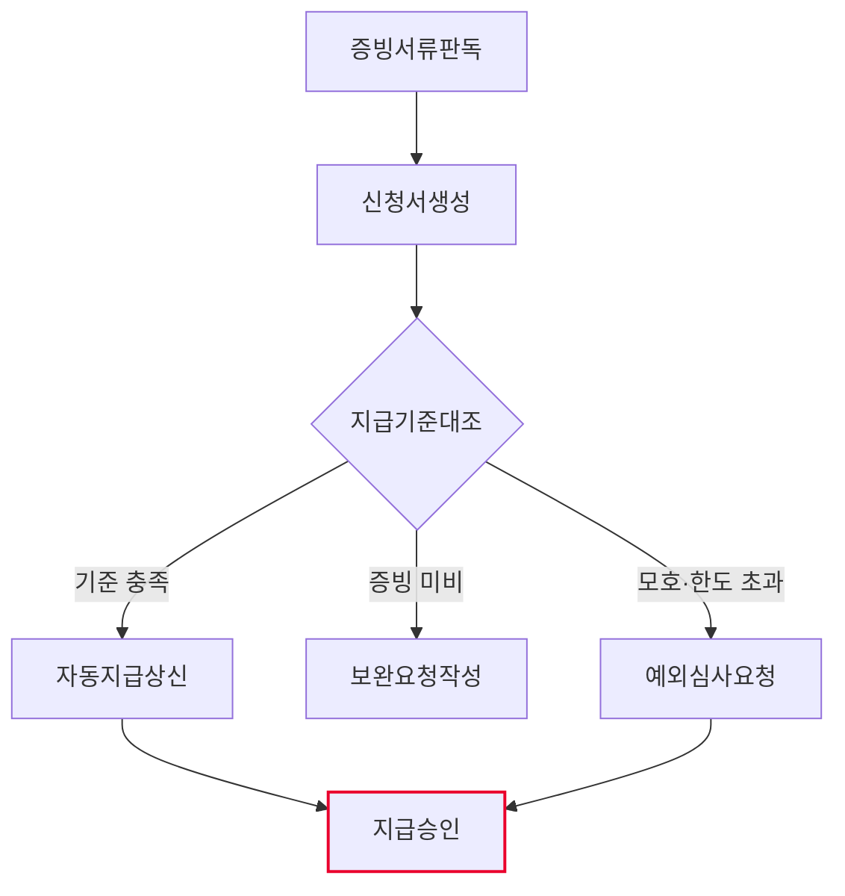
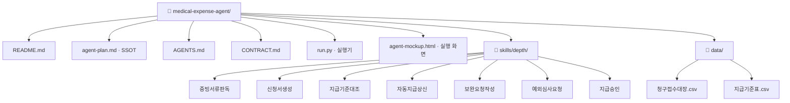

# 의료비 청구 건 판독·지급 판정 팀 기획서

> 출처: SKI AX 과제 목록 · 주관조직 **Talent AX실** · AX Level 3 · Moonshot 「HR AI」 ·
> AX 과제명 **의료비 판독 AI**
> 과제 상세: OCR 기반 의료비 증빙서류에서 Data 추출 및 신청서 자동 생성 / 운영 기준에 따라 지급 여부 판단

## 1. 팀과 목적
- Lv4: 의료비 지원 운영
- Lv5: 의료비 청구 건 판독·지급 판정
- 목적(과제 목적란 그대로): 표준화된 양식 기반 의료비 Data 분류 자동화 ·
  수기 분류 작업 효율화, 데이터 정제 시간 절감 · 의료비 신청 후 지급까지 대기 시간 단축

## 2. 역할 정의
- 한 문장: 접수된 의료비 청구 건을 판독해 **지급 / 보완 / 예외심사** 중 어디로 갈지 가르고,
  각 갈래의 서류를 초안까지 만들어 사람 앞에 놓는다.
- 하는 일: 증빙서류판독 · 신청서생성 · 지급기준대조 · 자동지급상신 · 보완요청작성 · 예외심사요청
- 하지 않는 일: 지급승인 (사람고유) · 지급 실행 · 신청자에게 자동 발송

## 2-1. 태스크 구성

| # | Lv6 | Human 여부 | Skill화 | 다음 태스크 |
|---|---|---|---|---|
| 1 | 증빙서류판독 | 자동 | 높음 | 신청서생성 |
| 2 | 신청서생성 | 자동 | 높음 | 지급기준대조 |
| 3 | 지급기준대조 | 증강 | 중간 | 자동지급상신 또는 보완요청작성 또는 예외심사요청 |
| 4 | 자동지급상신 | 자동 | 높음 | 지급승인 |
| 5 | 보완요청작성 | 증강 | 중간 | (끝) |
| 6 | 예외심사요청 | 증강 | 낮음 | 지급승인 |
| 7 | 지급승인 | 사람고유 | 낮음 | (끝) |

AI 태스크(자동+증강) 6개 · 사람고유 1개 · 갈림길 있음(경로 3개)

ATF ③다단계성 충족(6 ≥ 3) · ④순서 가변성 충족(갈림길 1곳) → **팀 에이전트**

## 3. 데이터 명세

| 표 이름 | 칸 이름 | 원본 위치(SSOT) | 읽기/쓰기 |
|---|---|---|---|
| 청구접수대장.csv | 청구번호·사번·성명·진료일·병원명·청구금액·증빙유형·증빙파일·진단코드·수진자관계 | 복리후생 접수 시스템 | 증빙서류판독이 읽기 |
| 지급기준표.csv | 기준항목·적용대상·연간한도·자기부담률·필수증빙·비고 | 복리후생 운영기준 (인사팀 관리) | 지급기준대조가 읽기 |
| 신청서초안.csv | 청구번호·사번·성명·청구금액·진단코드·중증후보·상태 | 이 에이전트가 생성 | 신청서생성이 쓰기 |
| 지급대장.csv | 청구번호·사번·성명·청구금액·자기부담률·지급액·기준항목·상태 | 이 에이전트가 생성 | 자동지급상신이 쓰기 |
| 예외심사대장.csv | 청구번호·사번·성명·청구금액·예외사유·심사근거·상태 | 이 에이전트가 생성 | 예외심사요청이 쓰기 |

> 실습용 **가상 값**이다. 실도입 전에 실제 표·칸 이름으로 교체한다.

## 4. 대표 시나리오
- 입력: 의료비청구건판독·지급판정입력 (= 청구접수대장.csv의 미처리 행)
- 경로 A: 증빙서류판독 → 신청서생성 → 지급기준대조 → 자동지급상신 → 지급승인 → 산출물: 지급승인결과
- 경로 B: 증빙서류판독 → 신청서생성 → 지급기준대조 → 보완요청작성 → 산출물: 보완요청작성결과
- 경로 C: 증빙서류판독 → 신청서생성 → 지급기준대조 → 예외심사요청 → 지급승인 → 산출물: 지급승인결과

## 5. 결과물 반영 규칙
- 세 대장(신청서초안.csv·지급대장.csv·예외심사대장.csv)은 각각 **기록자가 하나뿐**이다.
- 같은 청구번호를 덮어쓰지 않는다. 중복이면 상태 칸에 `중복`으로 적고 원본을 남긴다.
- 지급 실행·메일 발송 코드는 이 팩에 두지 않는다.

## 6. 연동 맵
- 현재는 독립. 상류(접수 시스템)에서 청구접수대장.csv를 받고, 하류 Lv5 「의료비 지급 실행·정산」으로
  승인 결과를 넘긴다. 연동 형식은 (미정 — 실도입 시 확정).

## 7. 검증·휴먼인더루프 지점
- 지급승인 — 사람고유. 확인 요청 후 멈춘다. 팀장이 승인할 때까지 지급하지 않는다.
- 보완요청작성 — 흐름의 끝. 안내문을 초안으로만 만들고 담당자 확인까지 멈춘다. 자동 발송 없음.
- 예외심사요청 — 대장에 올리기만 하고 지급 여부를 추천하지 않는다.

## 8. 흐름도

- 마름모 = 갈림길 · 빨간 테두리 = 사람이 직접 판단하는 지점

## 9. 폴더 트리

