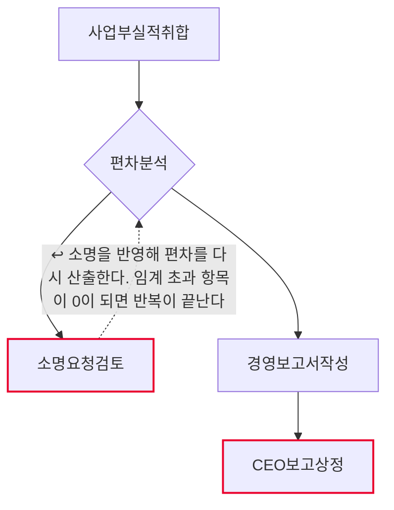
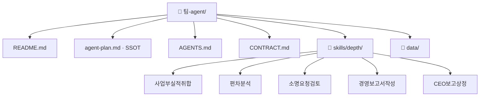

# 월간 실적 마감 및 경영보고 팀 기획서 (워크플로우 변환 초안)

## 1. 팀과 목적
- Lv4: 실적관리
- Lv5: 월간 실적 마감 및 경영보고

## 2. 역할 정의
- 한 문장: 사업부 실적을 취합해 하나의 임계 기준으로 편차를 산출하고, 임계를 넘은 항목의
  소명을 받아 경영보고서 초안까지 만든다. 보고서 확정과 CEO 상정은 하지 않는다.
- 하는 일: 사업부실적취합 · 편차분석 · 경영보고서작성
- 하지 않는 일: 소명요청검토 · CEO보고상정

## 2-1. 태스크 구성
| # | Lv6 | Human 여부 | Skill화 | 다음 태스크 |
|---|---|---|---|---|
| 1 | 사업부실적취합 | 자동 | 높음 | 편차분석 |
| 2 | 편차분석 | 자동 | 높음 | 소명요청검토 또는 경영보고서작성 |
| 3 | 소명요청검토 | 사람고유 | 낮음 | 편차분석 ↩루프백 |
| 4 | 경영보고서작성 | 증강 | 중간 | CEO보고상정 |
| 5 | CEO보고상정 | 사람고유 | 낮음 | (끝) |

AI 태스크(자동+증강) 3개 · 사람고유 2개 · 갈림길 있음(경로 2개) · 루프백 있음

## 3. 데이터 명세

| 표 이름 | 칸 이름 | 원본 위치(SSOT) | 읽기/쓰기 |
|---|---|---|---|
| 실적데이터.md › 사업부제출 | 사업부코드·사업부명·제출여부·제출일·비고 | 사업부 제출 로그 | 사업부실적취합이 읽기 |
| 실적데이터.md › 월간실적 | 사업부코드·항목·계획·실적 | SAP 실적 · 사업부 제출 자료 | 사업부실적취합·편차분석이 읽기 |
| 실적데이터.md › 편차임계 | 항목·임계율 | 전략기획팀 편차 기준 (통일본) | 편차분석이 읽기 |
| 실적데이터.md › 소명접수 | 사업부코드·항목·소명사유·인정여부 | 소명 회신 기록 | 소명요청검토·편차분석이 읽기 |
| 실적데이터.md › 보고서양식 | 순번·절 이름·필수 | 경영보고서 표준 양식 | 경영보고서작성이 읽기 |
| 실적취합결과.md | 사업부코드·사업부명·제출여부·제출일·항목수·상태 | 이 에이전트가 생성 | 사업부실적취합이 쓰기 |
| 편차분석결과.md | 사업부코드·사업부명·항목·계획·실적·편차·편차율·임계율·판정 | 이 에이전트가 생성 | 편차분석이 쓰기 |
| 경영보고서초안.md | 순번·절 이름·필수·상태·근거 | 이 에이전트가 생성 | 경영보고서작성이 쓰기 |

입력은 **`data/실적데이터.md` 한 파일**이고, 그 안에 표 5개가 `## 제목`으로 나뉘어 있다.
표마다 왜 그 값인지가 문장으로 붙어 있어 교육생이 값을 고쳐가며 흐름이 어디로 갈라지는지 볼 수 있다.
산출물도 전부 마크다운 표로 나온다 — 만든 것을 그대로 열어 볼 수 있다.

> 실습용 **가상 값**이다. 사업부·실적·계획 모두 실재하지 않는다.
> 실도입 전에 SAP·사업부 제출 자료로 교체한다.

## 4. 대표 시나리오
- 입력: 월간실적마감및경영보고입력
- 경로: 사업부실적취합 → 편차분석 → 소명요청검토 → 출력: 소명요청검토결과
- 경로: 사업부실적취합 → 편차분석 → 경영보고서작성 → CEO보고상정 → 출력: CEO보고상정결과

## 5. 결과물 반영 규칙
- 산출물은 전부 `out/` 아래 마크다운 표다. 원본 데이터(`data/실적데이터.md`)는 고치지 않는다.
- 미제출 사업부의 실적은 0으로 채우지 않고 편차 분석에서 제외한다.
- 소명은 사람이 `인정`한 것만 반영한다. 스킬이 소명을 만들거나 인정하지 않는다.
- 근거가 없는 보고서 절은 만들지 않고 `자료없음`으로 남긴다.

## 6. 연동 맵
- (미정 — 인터뷰 Q6)

## 7. 검증·휴먼인더루프 지점
- 소명요청검토 — 사람고유. 확인 요청 후 멈춘다.
- CEO보고상정 — 사람고유. 확인 요청 후 멈춘다.

## 8. 원본 대조 (디자인캠프 Lv3~Lv6 → 이 팩)

| 원본 계층 | 원본 항목 | 우리 계층 | 이 팩의 무엇이 되었나 |
|---|---|---|---|
| Lv3 업무 | 실적관리 | **Lv4** | 문서에만 — 팩 범위 밖 |
| Lv4 프로세스 | P-C2-1 월간 실적 마감 및 경영보고 | **Lv5** | **이 팩 = 에이전트 1개** |
| Lv5 Task | T-C2-1-1 사업부실적취합 | **Lv6** | `skills/depth/사업부실적취합/SKILL.md` |
| Lv5 Task | T-C2-1-2 편차분석 | **Lv6** | `skills/depth/편차분석/SKILL.md` |
| Lv5 Task | T-C2-1-3 소명요청검토 | **Lv6** | `skills/depth/소명요청검토/SKILL.md` |
| Lv5 Task | T-C2-1-4 경영보고서작성 | **Lv6** | `skills/depth/경영보고서작성/SKILL.md` |
| Lv5 Task | T-C2-1-5 CEO보고상정 | **Lv6** | `skills/depth/CEO보고상정/SKILL.md` |
| Lv6 Activity | (원본 문서 참조) | 판단기준 | 각 SKILL.md 본문 |

원본 Lv5 Task 5개 → 스킬 5개 (전부 옮김)

## 9. 흐름도

- 마름모 = 갈림길 · 빨간 테두리 = 사람이 직접 판단하는 지점 · 점선 = 루프백(되돌아가기)

## 10. 폴더 트리

