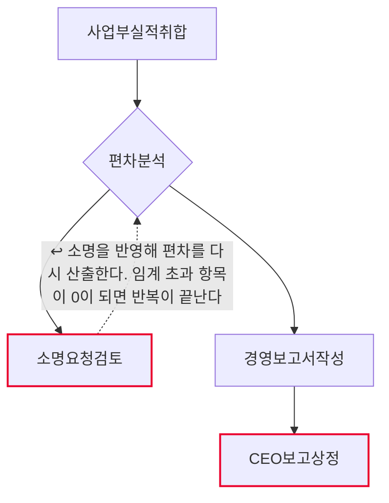
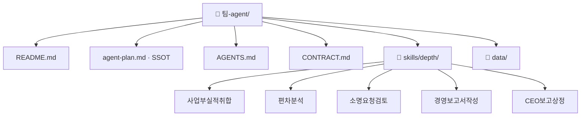

# 월간 실적 마감 및 경영보고 팀 기획서 (워크플로우 변환 초안)

## 1. 팀과 목적
- Lv4: 실적관리
- Lv5: 월간 실적 마감 및 경영보고

## 2. 역할 정의
- 한 문장: (미정 — 인터뷰 Q2)
- 하는 일: 사업부실적취합 · 편차분석 · 경영보고서작성
- 하지 않는 일: 소명요청검토 · CEO보고상정

## 2-1. 태스크 구성
| # | Lv6 | Human 여부 | Skill화 | 다음 태스크 |
|---|---|---|---|---|
| 1 | 사업부실적취합 | 자동 | 높음 | 편차분석 |
| 2 | 편차분석 | 자동 | 높음 | 소명요청검토 또는 경영보고서작성 |
| 3 | 소명요청검토 | 사람고유 | 낮음 | 편차분석 ↩루프백 |
| 4 | 경영보고서작성 | 증강 | 중간 | CEO보고상정 |
| 5 | CEO보고상정 | 사람고유 | 낮음 | (끝) |

AI 태스크(자동+증강) 3개 · 사람고유 2개 · 갈림길 있음(경로 2개) · 루프백 있음

## 3. 데이터 명세
| 표 이름 | 칸 이름 | 원본 위치(SSOT) | 읽기/쓰기 |
|---|---|---|---|
| (미정) | (미정) | (미정) | (미정) |
> 설계도에는 표·칸 명세가 없다. 세션 6 인터뷰 Q3에서 확정한다.

## 4. 대표 시나리오
- 입력: 월간실적마감및경영보고입력
- 경로: 사업부실적취합 → 편차분석 → 소명요청검토 → 출력: 소명요청검토결과
- 경로: 사업부실적취합 → 편차분석 → 경영보고서작성 → CEO보고상정 → 출력: CEO보고상정결과

## 5. 결과물 반영 규칙
- (미정 — 인터뷰 Q5)

## 6. 연동 맵
- (미정 — 인터뷰 Q6)

## 7. 검증·휴먼인더루프 지점
- 소명요청검토 — 사람고유. 확인 요청 후 멈춘다.
- CEO보고상정 — 사람고유. 확인 요청 후 멈춘다.

## 8. 흐름도

- 마름모 = 갈림길 · 빨간 테두리 = 사람이 직접 판단하는 지점 · 점선 = 루프백(되돌아가기)

## 9. 폴더 트리

