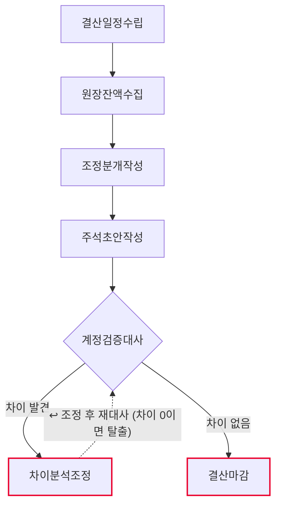
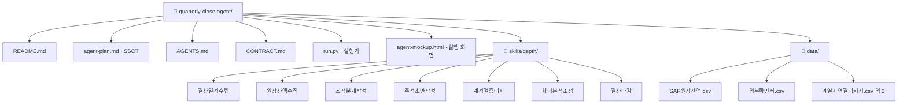

# 분기/반기 결산 팀 기획서

> 출처: **AX전략 워크샵 · 재무본부 회계관리팀** (2026-08-18)
> Workshop Agent 1 → 2-1 → 2-2 → 3 → 4 체인의 산출물에서 옮겼다.
> 원본 프로세스 **P-A2-1 분기/반기 결산** — As-Is 23노드로 13개 프로세스 중 최대 규모.

## 1. 팀과 목적
- Lv4: 별도/연결 결산관리 (원본 Lv3 업무)
- Lv5: 분기/반기 결산 (원본 Lv4 프로세스 P-A2-1)
- 목적: Agent 3이 결산 지연의 주요 원인으로 지목한 **루프백 L4(차이대사)** 를 줄인다.
  Agent 4의 OPT-6 「PDF 수동 대사 → OCR+자동 매칭」이 이 지점을 겨냥한다 (13h/월 절감 추정).

### 레벨 대응
원본 문서(Agent 3·4)와 우리 도구의 레벨 이름이 다르다. 대응은 이렇다.

| 원본 (회계관리팀 Task Tree) | 우리 |
|---|---|
| Lv3 업무 「별도/연결 결산관리」 | Lv4 |
| Lv4 프로세스 `P-A2-1` 「분기/반기 결산」 | **Lv5** ← 패키징 단위 |
| Lv5 Task `T-A2-1-1~6` | **Lv6** ← 스킬 하나씩 |
| Lv6 Activity `A-A2-1-*` (18개) | 각 스킬 본문의 판단기준 |

> 원본 Agent 1은 Lv5를 「Activity」로, Agent 3·4는 Lv6를 「Activity」로 부른다.
> 같은 워크샵 안에서 이름이 뒤집혀 있어, 여기서는 **Agent 3·4 기준**을 따랐다.

## 2. 역할 정의
- 한 문장: 결산 잔액을 모아 조정분개와 주석 초안을 만들고, 외부확인서와 대사해
  **차이가 있으면 사람에게 돌려보내고 없으면 마감 점검표를 만든다.**
- 하는 일: 결산일정수립 · 원장잔액수집 · 조정분개작성 · 주석초안작성 · 계정검증대사
- 하지 않는 일: 차이분석조정 (사람고유) · 결산마감 (사람고유) · 마감 전표 처리 · 원장 Lock

## 2-1. 태스크 구성

| # | Lv6 (원본 Task) | Human 여부 | Skill화 | 다음 태스크 |
|---|---|---|---|---|
| 1 | 결산일정수립 (T-A2-1-1) | 증강 | 중간 | 원장잔액수집 |
| 2 | 원장잔액수집 (T-A2-1-2) | 자동 | 높음 | 조정분개작성 |
| 3 | 조정분개작성 (T-A2-1-3) | 증강 | 중간 | 주석초안작성 |
| 4 | 주석초안작성 (T-A2-1-4) | 증강 | 중간 | 계정검증대사 |
| 5 | 계정검증대사 (T-A2-1-5) | 증강 | 중간 | 차이분석조정 또는 결산마감 |
| 6 | 차이분석조정 (A-A2-1-5-3) | 사람고유 | 낮음 | 계정검증대사 ↩루프백 |
| 7 | 결산마감 (T-A2-1-6) | 사람고유 | 낮음 | (끝) |

AI 태스크(자동+증강) 5개 · 사람고유 2개 · 갈림길 있음(경로 2개) · **루프백 있음**

ATF ③다단계성 충족(5 ≥ 3) · ④순서 가변성 충족(갈림길 1곳 + 루프백 1곳) → **팀 에이전트**

## 3. 데이터 명세

| 표 이름 | 칸 이름 | 원본 위치(SSOT) | 읽기/쓰기 |
|---|---|---|---|
| 결산캘린더.csv | 구분·마감일·담당부서·제출기한·상태 | 회계관리팀 결산 캘린더 | 결산일정수립이 읽기 |
| SAP원장잔액.csv | 계정코드·계정명·당기잔액·전기잔액·구분 | SAP ERP | 원장잔액수집이 읽기 |
| 계열사연결패키지.csv | 계열사코드·계열사명·수신여부·수신일자·순자산 | 계열사 제출 | 원장잔액수집이 읽기 |
| 전기주석.csv | 주석번호·주석항목·전기금액·설명 | 전기 재무제표 주석 | 주석초안작성이 읽기 |
| 외부확인서.csv | 계정코드·확인처·확인잔액·수신여부·확인서번호 | 은행·거래처 확인서(PDF → OCR) | 계정검증대사가 읽기 |
| 잔액수집결과.csv | 계정코드·계정명·당기잔액·전기잔액·증감률·이상여부 | 이 에이전트가 생성 | 원장잔액수집이 쓰기 |
| 조정분개장.csv | 분개번호·계정코드·차변·대변·사유·상태 | 이 에이전트가 생성 | 조정분개작성이 쓰기 |
| 주석초안.csv | 주석번호·주석항목·전기금액·당기금액·증감률·상태 | 이 에이전트가 생성 | 주석초안작성이 쓰기 |
| 대사결과.csv | 계정코드·계정명·원장잔액·확인잔액·차이·상태·회차 | 이 에이전트가 생성 | 계정검증대사가 쓰기 |

> 실습용 **가상 값**이다. 원본 문서의 사용 시스템은 SAP ERP·DART·공정위 시스템·내부회계
> 전용시스템·Excel·PPT·Word/HWP·카드사 EDI·PBC 포털 9개다. 실도입 전에 교체한다.

## 4. 대표 시나리오
- 입력: 분기/반기결산입력 (= 2026년 3분기 결산 개시)
- 경로 A (차이 있음): 결산일정수립 → 원장잔액수집 → 조정분개작성 → 주석초안작성 →
  계정검증대사 → **차이분석조정** → 산출물: 차이분석조정결과
  → 조정 후 계정검증대사로 되돌아가 재대사
- 경로 B (차이 없음): 결산일정수립 → 원장잔액수집 → 조정분개작성 → 주석초안작성 →
  계정검증대사 → **결산마감** → 산출물: 결산마감결과

## 5. 결과물 반영 규칙
- 네 대장(잔액수집결과·조정분개장·주석초안·대사결과)은 각각 **기록자가 하나뿐**이다.
- 대사결과.csv는 회차마다 덮어쓰지 않고 `회차` 칸을 늘려 쌓는다 — 몇 바퀴 돌았는지가 개선 지표다.
- 마감 전표 처리·원장 Lock 코드는 이 팩에 두지 않는다.

## 6. 연동 맵
- 상류: SAP ERP(원장), 계열사(연결패키지), 은행·거래처(외부확인서 PDF).
- 하류: Lv5 「결산 분석 및 이사회 보고」(원본 P-A2-2)로 확정 잔액을 넘긴다.
- 연동 형식은 (미정 — 실도입 시 확정).

## 7. 검증·휴먼인더루프 지점
- 차이분석조정 — 사람고유. 결산담당이 조정 내용을 확정할 때까지 멈춘다. 조정 금액을 대신 정하지 않는다.
- 결산마감 — 사람고유. 팀장이 점검표를 확인하고 승인할 때까지 멈춘다. 원장 Lock은 팀장이 SAP에서 직접 한다.

## 8. 흐름도

- 마름모 = 갈림길 · 빨간 테두리 = 사람이 직접 판단하는 지점 · 점선 = 루프백(되돌아가기)

## 9. 폴더 트리

