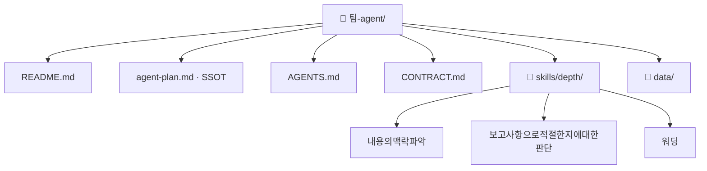

# 정확하고 간결한 내용 정리 팀 기획서 (워크플로우 변환 초안)

## 1. 팀과 목적
- Lv4: 전사 경영전략실 송부 정기보고서 작성(본부장 Monthly, CEO Weekly 등)
- Lv5: 정확하고 간결한 내용 정리

## 2. 역할 정의
- 한 문장: (미정 — 인터뷰 Q2)
- 하는 일: 내용의 맥락 파악 · 워딩
- 하지 않는 일: 보고사항으로 적절한지에 대한 판단

## 2-1. 태스크 구성
| # | Lv6 | Human 여부 | Skill화 |
|---|---|---|---|
| 1 | 내용의 맥락 파악 | 증강 | 높음 |
| 2 | 보고사항으로 적절한지에 대한 판단 | 사람고유 | 낮음 |
| 3 | 워딩 | 증강 | 높음 |

AI 태스크(자동+증강) 2개 · 사람고유 1개

## 3. 데이터 명세
| 표 이름 | 칸 이름 | 원본 위치(SSOT) | 읽기/쓰기 |
|---|---|---|---|
| (미정) | (미정) | (미정) | (미정) |
> 설계도에는 표·칸 명세가 없다. 세션 6 인터뷰 Q3에서 확정한다.

## 4. 대표 시나리오
- 입력: 정확하고간결한내용정리입력 → 처리: 내용의맥락파악 → 보고사항으로적절한지에대한판단 → 워딩 → 출력: 워딩결과

## 5. 결과물 반영 규칙
- (미정 — 인터뷰 Q5)

## 6. 연동 맵
- (미정 — 인터뷰 Q6)

## 7. 검증·휴먼인더루프 지점
- 보고사항으로 적절한지에 대한 판단 — 사람고유. 확인 요청 후 멈춘다.

## 8. 폴더 트리

