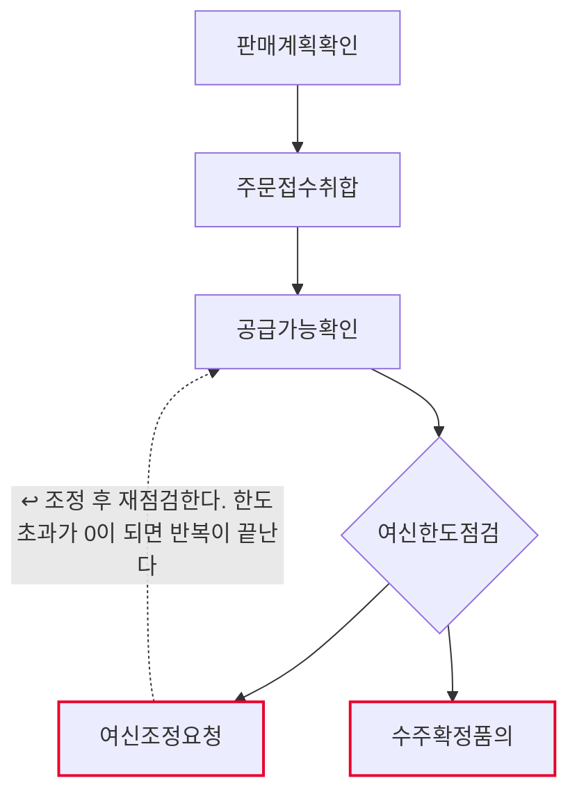
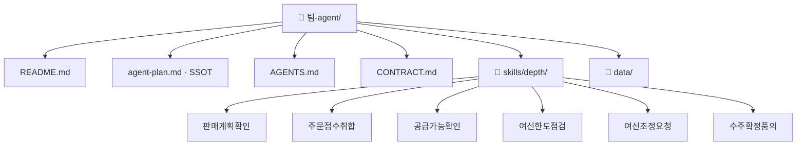

# 월간 수주·여신 심사 팀 기획서 (워크플로우 변환 초안)

## 1. 팀과 목적
- Lv4: 석유제품 영업
- Lv5: 월간 수주·여신 심사

## 2. 역할 정의
- 한 문장: 이번 달 주문을 모아 제품별 공급가능량과 거래처별 여신 한도에 맞는지 점검하고,
  한도를 넘는 거래처를 찾아 조정 대상으로 올린다. 수주 확정과 출하 지시는 하지 않는다.
- 하는 일: 판매계획확인 · 주문접수취합 · 공급가능확인 · 여신한도점검
- 하지 않는 일: 여신조정요청 · 수주확정품의

## 2-1. 태스크 구성
| # | Lv6 | Human 여부 | Skill화 | 다음 태스크 |
|---|---|---|---|---|
| 1 | 판매계획확인 | 자동 | 높음 | 주문접수취합 |
| 2 | 주문접수취합 | 자동 | 높음 | 공급가능확인 |
| 3 | 공급가능확인 | 증강 | 중간 | 여신한도점검 |
| 4 | 여신한도점검 | 증강 | 중간 | 여신조정요청 또는 수주확정품의 |
| 5 | 여신조정요청 | 사람고유 | 낮음 | 공급가능확인 ↩루프백 |
| 6 | 수주확정품의 | 사람고유 | 낮음 | (끝) |

AI 태스크(자동+증강) 4개 · 사람고유 2개 · 갈림길 있음(경로 2개) · 루프백 있음

## 3. 데이터 명세

| 표 이름 | 칸 이름 | 원본 위치(SSOT) | 읽기/쓰기 |
|---|---|---|---|
| 수주데이터.md › 판매계획 | 제품·월간계획량·누계실적 | 영업기획 월간 판매계획 | 판매계획확인이 읽기 |
| 수주데이터.md › 거래처마스터 | 거래처코드·거래처명·채널·여신한도·현재여신 | 여신관리시스템 | 주문접수취합·여신한도점검이 읽기 |
| 수주데이터.md › 주문접수 | 주문번호·거래처코드·제품·주문량·접수일·상태 | SAP SD 수주 전표 | 주문접수취합이 읽기 |
| 수주데이터.md › 재고생산 | 제품·가용재고·생산예정 | SAP MM 재고 · 생산계획 | 공급가능확인이 읽기 |
| 수주데이터.md › 제품단가 | 제품·기준단가 | 가격정책 기준단가표 | 주문접수취합·여신한도점검이 읽기 |
| 수주데이터.md › 여신예외승인 | 거래처코드·승인사유 | 여신 예외 승인 기록 | 여신한도점검이 읽기 |
| 판매계획확인결과.md | 제품·월간계획량·누계실적·진척률·판정 | 이 에이전트가 생성 | 판매계획확인이 쓰기 |
| 주문취합결과.md | 주문번호·거래처코드·거래처명·제품·주문량·금액·상태 | 이 에이전트가 생성 | 주문접수취합이 쓰기 |
| 공급가능결과.md | 제품·가용재고·생산예정·공급가능·주문합계·과부족·판정 | 이 에이전트가 생성 | 공급가능확인이 쓰기 |
| 여신점검결과.md | 거래처코드·거래처명·여신한도·현재여신·신규주문·합계·여유·판정 | 이 에이전트가 생성 | 여신한도점검이 쓰기 |

입력은 **`data/수주데이터.md` 한 파일**이고, 그 안에 표 6개가 `## 제목`으로 나뉘어 있다.
표마다 왜 그 값인지가 문장으로 붙어 있어 교육생이 값을 고쳐가며 흐름이 어디로 갈라지는지 볼 수 있다.
산출물도 전부 마크다운 표로 나온다 — 만든 것을 그대로 열어 볼 수 있다.

> 실습용 **가상 값**이다. 거래처명·여신한도·주문·재고 모두 실재하지 않는다.
> 실도입 전에 SAP SD·MM·여신관리시스템의 실제 데이터로 교체한다.

## 4. 대표 시나리오
- 입력: 월간수주여신심사입력
- 경로: 판매계획확인 → 주문접수취합 → 공급가능확인 → 여신한도점검 → 여신조정요청 → 출력: 여신조정요청결과
- 경로: 판매계획확인 → 주문접수취합 → 공급가능확인 → 여신한도점검 → 수주확정품의 → 출력: 수주확정품의결과

## 5. 결과물 반영 규칙
- 산출물은 전부 `out/` 아래 마크다운 표다. 원본 데이터(`data/수주데이터.md`)는 고치지 않는다.
- 취소·보류 주문은 집계에서 빼되 표에서 지우지 않는다 — 집계 밖인 것과 없는 것은 다르다.
- 주문량은 어떤 단계에서도 스킬이 줄이지 않는다. 조정은 사람이 확정한 것만 반영한다.
- 금액은 기준단가 기준이다. 할인·정산 조건이 없으므로 실제 청구액과 다를 수 있다고 적는다.

## 6. 연동 맵
- (미정 — 인터뷰 Q6)

## 7. 검증·휴먼인더루프 지점
- 여신조정요청 — 사람고유. 확인 요청 후 멈춘다.
- 수주확정품의 — 사람고유. 확인 요청 후 멈춘다.

## 8. 원본 대조 (디자인캠프 Lv3~Lv6 → 이 팩)

| 원본 계층 | 원본 항목 | 우리 계층 | 이 팩의 무엇이 되었나 |
|---|---|---|---|
| Lv3 업무 | 석유제품 영업 | **Lv4** | 문서에만 — 팩 범위 밖 |
| Lv4 프로세스 | P-C3-1 월간 수주·여신 심사 | **Lv5** | **이 팩 = 에이전트 1개** |
| Lv5 Task | T-C3-1-1 판매계획확인 | **Lv6** | `skills/depth/판매계획확인/SKILL.md` |
| Lv5 Task | T-C3-1-2 주문접수취합 | **Lv6** | `skills/depth/주문접수취합/SKILL.md` |
| Lv5 Task | T-C3-1-3 공급가능확인 | **Lv6** | `skills/depth/공급가능확인/SKILL.md` |
| Lv5 Task | T-C3-1-4 여신한도점검 | **Lv6** | `skills/depth/여신한도점검/SKILL.md` |
| Lv5 Task | A-C3-1-4-2 여신조정요청 | **Lv6** | `skills/depth/여신조정요청/SKILL.md` |
| Lv5 Task | T-C3-1-5 수주확정품의 | **Lv6** | `skills/depth/수주확정품의/SKILL.md` |
| Lv6 Activity | (원본 문서 참조) | 판단기준 | 각 SKILL.md 본문 |

원본 Lv5 Task 6개 → 스킬 6개 (전부 옮김)

## 9. 흐름도

- 마름모 = 갈림길 · 빨간 테두리 = 사람이 직접 판단하는 지점 · 점선 = 루프백(되돌아가기)

## 10. 폴더 트리

