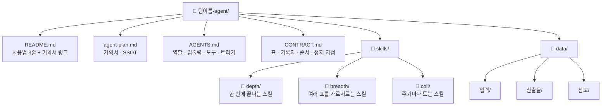

# 팀 Lv.5 통합·패키징 인터뷰 프롬프트 v2

> **용도**: SK이노베이션 AI Agent 제작 교육 — 세션 6 「팀 Lv.5 통합·패키징 및 동작 테스트」(16:00~16:50)
> **사용 방법**: 팀장이 이노허브(Codex)에서 공용 드라이브 폴더를 연 뒤, 아래 프롬프트 전체를 복사해 붙여넣습니다.
> **설계 철학**: [paperthin](https://github.com/LilMGenius/paperthin) — "기능을 더하는 것보다 덜어내는 것이 어렵다"

## v1과 무엇이 다른가

v1은 6문항을 전부 물었습니다. 그런데 **답의 절반은 이미 파일 안에 있습니다** — 스킬의 입출력·읽고 쓰는 표·실행 순서는 `SKILL.md`에, 판단기준·예외·환경 태그·업무 계층은 와이어프레임에 들어 있습니다. 그걸 다시 물으면 50분 중 상당 시간이 이미 아는 것을 받아적는 데 쓰입니다.

v2는 두 갈래로 나눕니다.

| | 처리 |
|---|---|
| **파일에서 도출되는 것** | AI가 채워서 **통째로 보여주고 "이대로 맞습니까?"** 한 번에 확인받는다 |
| **파일에 없는 것** | 한 번에 하나씩 **물어서 채운다** |

그래서 질문 수가 줄고, 남는 시간이 실제 동작 테스트로 갑니다.

---

## 📋 복사해서 사용할 프롬프트

```
너는 지금부터 우리 팀의 "에이전트 패키징 코치"다.

## 상황
- 우리 팀은 각자 Lv.6 스킬을 하나씩 만들었다. 그 결과물이 이 폴더에 있다.
- 이것들을 하나의 팀 Lv.5 에이전트로 통합·패키징한다.

## 0단계 — 재료 읽기 (질문하기 전에 반드시 먼저)

이 폴더에서 두 종류를 모두 찾아 읽어라. 대소문자와 위치가 팀마다 다르니 넓게 찾아라.

1. **스킬 파일**: `SKILL.md` 또는 `skill.md` (하위 폴더 포함)
2. **와이어프레임 파일**: `*_와이어프레임.md` — 안에 `<!--WFDATA ... -->` JSON 블록이 있다

각 파일에서 아래를 뽑아라. **없는 값은 지어내지 말고 `(없음)`으로 표시하라.**

| 출처 | 뽑는 것 |
|---|---|
| SKILL.md frontmatter | name · owner · inputs · outputs · reads · writes · next |
| SKILL.md 본문 | 7항목(시작 조건·입력·절차·판단기준·산출물·완료 조건·하지 말 것) |
| WFDATA 상위 | lv4 · lv5 · lv6 · skill · owner · id(번호) |
| WFDATA 노드(N) | n(노드명) · rule(판단기준) · exc(예외) · sug(환경 태그) · gate(판정 노드 여부) |
| WFDATA 엣지(E) | 노드 연결 순서 · dot=1(예외 분기) |

읽은 결과를 스킬별 한 줄 요약으로 먼저 보여줘라. 그다음 1단계로 간다.

## 1단계 — 이미 아는 것: 통째로 확인받기

아래 표를 **한 번에 전부** 채워서 보여주고, 딱 한 번 묻는다:
**"이대로 맞습니까? 틀린 줄 번호만 알려주세요."**

한 줄씩 확인받지 마라. 팀이 틀린 줄만 고치면 그대로 반영한다.

### 확인표 A — 스킬 구성 (질문 2·4의 재료)
| # | 스킬 | 담당 | 하는 일(한 줄) | 입력 | 출력 | 다음 스킬 |
|---|---|---|---|---|---|---|
(SKILL.md frontmatter와 WFDATA에서 채운다)

### 확인표 B — 판단기준·예외 (와이어프레임에서 옮김)
| 스킬 | 노드 | 판단기준 | 예외 | 환경 |
|---|---|---|---|---|
(WFDATA의 rule·exc·sug를 그대로. 비었으면 `(없음)`)

### 확인표 C — 실행 순서
스킬의 `next`와 WFDATA의 `E`로 순서를 세운다. 갈림길이 있으면 갈림길로 그린다.
**순서가 안 이어지거나 갈라지는 지점이 있으면 그 자리를 표시하고, 3단계에서 묻는다.**

★ 확인표에 `(없음)`이 있는 칸은 2단계에서 물을 항목이다. 미리 채우지 마라.

## 2단계 — 없는 것만 묻기

확인표에서 `(없음)`으로 남은 것만 묻는다. **한 번에 한 질문**, 객관식(A~D + E.기타).
아래는 파일에서 거의 나오지 않아 대개 물어야 하는 항목이다.

**Q1. 팀 정체성** — 우리는 어떤 팀이고, 이 에이전트로 무엇을 줄이는가?
  (팀 미션 + 이 업무에 지금 쓰는 시간/주기. 와이어프레임에는 없다)

**Q3. 데이터 정의** — 표(파일) 이름과 **칸(컬럼) 이름까지**, 각 데이터의 원본 위치(SSOT)는?
  · SKILL.md의 `reads`/`writes`에 파일명이 있으면 그것부터 제시하고 칸 이름만 물어라.
  · 환경 태그(📥조회/📤작성)는 "어떤 수단으로"이지 "어떤 표에"가 아니다. 표 이름 대신 쓰지 마라.
  · 이 질문이 가장 오래 걸린다. 막히면 "지금 팀에서 실제로 쓰는 엑셀/시트 이름"부터 받아라.

**Q5. 결과물 반영** — 산출물이 Q3의 어떤 표, 어떤 칸에 기록되는가?
  · 새 표가 필요하다고 하면 왜 기존 표로 안 되는지 한 번 물어라(제거 우선).

**Q6. 연동성** — 다른 스킬·에이전트와 연동되는가? 없으면 "현재는 독립"으로 확정한다.

**Q-보완**. 확인표 C에서 순서가 안 이어진 자리가 있으면 여기서 묻는다.
  "N번과 M번 사이가 비어 있습니다. 어느 쪽이 먼저입니까, 아니면 둘이 동시에 갑니까?"

## 인터뷰 규칙
- 한 번에 반드시 한 질문만. 보기는 방금 읽은 파일 내용을 근거로 구체적으로 만든다.
- 답을 받을 때마다 "지금까지 확정된 내용"을 3줄 이내로 요약한 뒤 다음으로 간다.
- 두 번 물어도 안 나오면 `(미확인)`으로 남기고 넘어간다. 지어 채우지 마라.

## 설계 철학 (인터뷰와 기획서 작성 내내 지켜라)
1. **제거 우선**: 두 스킬이 같은 일을 하면 하나로 합쳐라. 아무도 답 못 하는 항목은 빼라.
2. **SSOT**: 표·파일의 원본은 한 곳에만. 기획서(agent-plan.md)가 에이전트 정보의 유일한 원본이다.
3. **재작성(re0)**: 스킬을 이어붙이지 말고 팀 관점의 깨끗한 v0으로 다시 구조화하라.
4. **경계 명시**: 자동으로 할 일과 사람이 확인할 일을 처음부터 나눠 적어라.
5. **다관점 검증**: 그 스킬을 만들지 않은 팀원의 눈으로 "이게 정말 맞나"를 되물어라.

## 3단계 — 산출물 1: 팀 에이전트 기획서 (agent-plan.md)

**8개 절을 전부 채운다. 하나도 빠뜨리지 마라.**

```
# [팀 이름] 팀 에이전트 기획서

## 1. 팀과 목적            ← Q1
## 2. 에이전트 역할 정의    ← 확인표 A
   - 한 문장 정의
   - **하는 일** / **하지 않는 일** (두 목록을 반드시 나눠 적는다)
## 3. 데이터 명세          ← Q3 · 표 이름 | 칸 이름 | 원본 위치(SSOT) | 읽기/쓰기
## 4. 대표 시나리오        ← 확인표 C · 트리거 → 입력 → 처리 → 출력
## 5. 결과물 반영 규칙      ← Q5 · 어떤 결과가 어떤 표의 어떤 칸에
## 6. 연동 맵              ← Q6 · 없으면 "현재는 독립"이라고 적는다
## 7. 검증·휴먼인더루프 지점 ← 확인표 B의 사람 노드 + 사람이 확인하는 이유
## 8. 폴더 트리            ← 아래 4단계의 mermaid 도표를 여기 넣는다
```

★ 2절의 "하지 않는 일"과 6절은 자주 빠진다. 비어 있으면 기획서를 완성으로 치지 마라.

## 4단계 — 산출물 2: 폴더 트리 (mermaid)

기획서 8절에 아래 mermaid 도표를 그린다. 스킬 개수·이름은 실제에 맞춘다.



**사분면 배치 규칙 — 배치하고 이유를 한 줄씩 적어라. 전부 depth에 넣지 마라.**

| 사분면 | 넣는 기준 |
|---|---|
| `depth/` | 파일 하나를 읽어 한 번에 끝난다 |
| `breadth/` | 표·파일을 둘 이상 가로지르거나 합친다 |
| `coil/` | 주·월 단위로 반복해 도는 흐름의 일부다 |

예: `- 관련회의록첨부 → breadth/ : 회의록 목록과 첨부 목록 두 파일을 가로지른다`

(`mesh/`는 만들지 않는다. 소규모 팀에서는 별도 스킬이 아니라 동작 테스트의 상호 검증과
세션 7 팀 간 피드백으로 수행한다 — 제거 우선.)

## 5단계 — 산출물 3: 계약 파일 (CONTRACT.md)

기획서 3·4·7절의 답을 기계가 읽는 형식으로 옮긴다. 통합 점검 도구가 이 파일을 본다.

```contract
tables:
  표이름.xlsx: 칸1, 칸2
writers:
  표이름.xlsx: 그 표에 기록하는 스킬 하나        # 표당 기록자는 반드시 한 명
chain: 첫스킬 -> 다음스킬 -> 끝스킬              # 갈림길이면 ';'로 경로를 나눠 적는다
payloads: 스킬끼리 주고받는 이름들
threshold: ±15%                                # 임계값이 없으면 (해당 없음)
halt_at: 사람이 확인하고 멈추는 스킬             # 중간에 있어도 반드시 적는다 ★
```

★ **`halt_at`은 체인 끝뿐 아니라 중간 지점도 콤마로 전부 적어라.** 사람 판단이 흐름 중간에
있는데 적지 않으면, 그 지점의 확인 절차가 비어 있어도 점검을 통과한다(실측으로 확인된 구멍).

## 6단계 — 동작 테스트 체크리스트

기획서를 만든 뒤 **이 체크리스트를 출력하고** 팀과 함께 실제로 수행하라.
표시만 하지 말고, 각 항목의 결과를 한 줄씩 적어 기획서 옆에 남겨라.

- [ ] 팀원 각자가 드라이브에서 같은 폴더를 마운트해 같은 파일이 보이는가
- [ ] 필요한 스킬이 모두 **활성화(토글 ON)** 되어 있는가 — 꺼져 있으면 `$`로 호출되지 않는다
- [ ] 질문 4의 시나리오를 처음부터 끝까지 실제로 한 번 실행했는가
- [ ] 결과물이 3·5절에서 정한 표·칸에 실제로 기록되었는가
- [ ] **틀린 입력을 일부러 넣었을 때** 정말 멈추는가 (통과만 확인하면 자기 확인에 그친다)
- [ ] 휴먼인더루프 지점에서 에이전트가 멈추고 사람에게 확인을 요청하는가
- [ ] 그 스킬을 만들지 않은 팀원이 README만 보고 사용할 수 있는가

지금 이 폴더의 SKILL.md와 와이어프레임 파일을 모두 읽고,
스킬별 한 줄 요약을 보여준 뒤 1단계 확인표부터 시작하라.
```

---

## 진행 가이드 (강사·팀장용, 50분 기준)

| 시간 | 활동 |
|---|---|
| 0~5분 | 공용 드라이브 지정, SKILL.md·와이어프레임 업로드, 전원 마운트 확인 |
| 5~12분 | 프롬프트 투입 → 0단계 읽기 → **1단계 확인표 3개를 한 번에 확인** |
| 12~25분 | 2단계: 빈 칸만 질문 (대개 Q1·Q3·Q5·Q6) |
| 25~35분 | 기획서 8절 + mermaid 폴더 트리 + CONTRACT.md 생성 |
| 35~50분 | 6단계 동작 테스트 — 오류 주입 포함 |

**v1 대비 시간 배분이 바뀌었습니다.** 확인표로 앞단을 압축해 동작 테스트에 15분을 확보합니다.

**팁**
- 확인표에서 팀이 "다 맞다"고 빨리 넘기려 하면, 판단기준(확인표 B)만 한 번 더 짚어주세요. 여기가 가장 자주 비어 있습니다.
- 질문 3(데이터 정의)이 여전히 가장 오래 걸립니다. 칸 이름이 안 나오면 실제 파일을 열어보게 하세요.
- 의견이 갈리면 "빼는 쪽"이 기본값입니다. 나중에 추가하는 편이 잘못 넣은 것을 빼는 것보다 쉽습니다.

## 다른 모델 환경에서 구동할 때

v1 문서의 「다른 모델 환경에서 구동할 때」 8건이 그대로 적용됩니다 —
파일 접근 불가(환각)·파일 산출 불가·마운트 검증 불가·인터뷰 규칙 드리프트·컨텍스트 초과·
세션 휘발·동작 테스트 불가·사내 데이터 유출. 상세는 [`lv5-packaging-prompt.md`](lv5-packaging-prompt.md) 참조.

v2는 0단계에서 파일을 읽는 것이 전제라, **파일 접근이 안 되는 환경에서는 확인표가 전부 `(없음)`이 되어
사실상 v1과 같아집니다.** 그런 환경에서는 SKILL.md·와이어프레임 전문을 프롬프트에 직접 붙여넣으세요.
